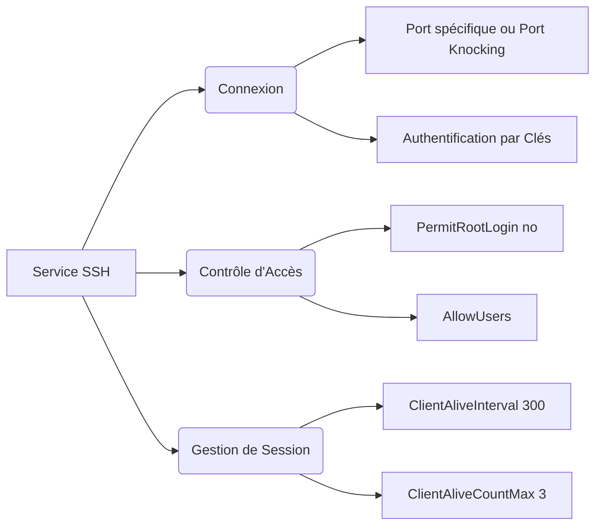

# Chapitre 1 : Première connexion

### 1. Gestion des Utilisateurs et Accès Locaux

La toute première étape consiste à verrouiller les accès de base du système.

- **Sécurisation du compte root** : Il est impératif de modifier le mot de passe `root`. Celui-ci doit être complexe, comporter au moins 16 caractères, et peut être généré à l'aide d'outils comme `pwgen`.

- **Comptes par défaut** : L'utilisateur configuré par défaut lors de l'installation doit être modifié.

- **Élévation de privilèges** : L'utilisation de `sudo` n'est pas toujours incontournable ; dans certains cas, la commande `su` est suffisante. Si `sudo` est conservé, il faut ajouter l'utilisateur au groupe dédié et configurer la directive `Defaults timestamp_timeout=0` pour forcer la demande de mot de passe à chaque exécution.

- **Déconnexion automatique** : Les utilisateurs inactifs doivent être déconnectés automatiquement. Cela se configure en ajoutant un script (par exemple `/etc/profile.d/timeout.sh`). Ce script exporte une variable `TMOUT=900` (15 minutes) configurée en lecture seule avec `readonly TMOUT`.

---

### 2. Sécurisation du Service SSH

Le service SSH est le point d'entrée principal et doit être particulièrement durci.

- **Connexion réseau** : Il faut changer le port 22 pour un autre port ou mettre en place un système de port knocking. La connexion par échange de clés SSH doit être privilégiée.

- **Restrictions d'accès** : La connexion directe avec le compte root doit être interdite via la directive `PermitRootLogin no`. Il faut également préciser explicitement quels comptes ont le droit de se connecter avec la directive `AllowUsers <users>`.

- **Timeouts SSH** : Un délai d'inactivité doit être configuré pour déconnecter les sessions fantômes. Cela s'opère via `ClientAliveInterval 300` (qui fixe l'intervalle de réveil) et `ClientAliveCountMax 3` (qui détermine le nombre de rappels avant la déconnexion).

---

### 3. Hygiène du Système et de l'Environnement (APT)

La gestion des paquets et des services installés limite la surface d'attaque.

- **Sources de paquets** : Il convient de vérifier le fichier `sources.list`. Pour éviter un saut de version inopiné lors d'une mise à jour, il faut renseigner le nom de code de la version (comme `trixie`) plutôt que d'utiliser le canal `stable`.

- **Heure système** : Il est nécessaire de vérifier qu'un serveur de temps (comme `ntp`) est bien installé et configuré.

- **Nettoyage** : Tous les paquets, compilateurs et interpréteurs inutiles doivent être supprimés du système.

---

### 4. Alertes et Surveillance (Mails & IDS/IPS)

Un serveur exposé doit pouvoir alerter son administrateur en cas d'anomalie.

- **Serveur de mails** : Par défaut, le système envoie ses alertes par mail à l'utilisateur `root`. Le serveur doit donc être capable d'envoyer des courriels, ce qu'un simple relais peut accomplir. Il faut éditer le fichier `/etc/aliases` pour rediriger ces alertes vers une adresse lisible (ex: `root: me@example.org`).

- **Détection d'intrusion** : L'installation d'un système de détection et de prévention d'intrusion (IDS/IPS) est requise. Il faut déployer au grand minimum l'outil `fail2ban`.

 

<a href="../README.md">⬅️ Vers le readme</a> | 
<a href="../Chapitre-2/Explication.md">Chapitre suivant ➡️</a>

