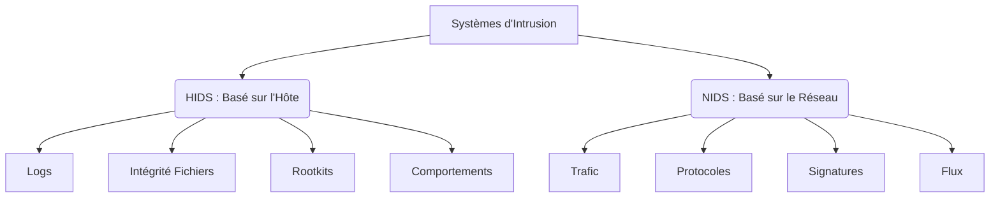
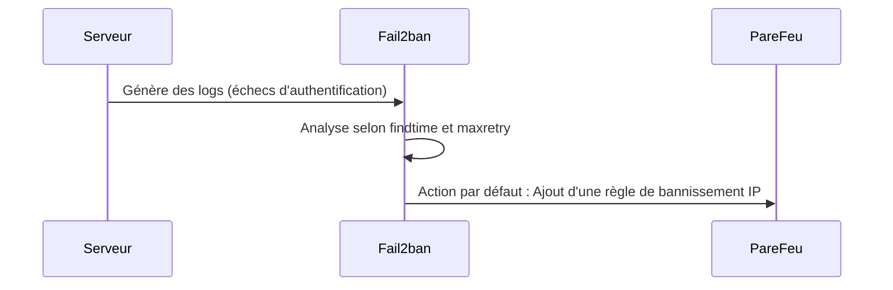

# Chapitre 2 : IDS|IPS

### 1. Concepts Fondamentaux : IDS et IPS

Un système de détection d'intrusion (IDS) a pour rôle de repérer les activités anormales au sein d'un système et de lever une alerte. Lorsque ce système est capable de prendre des mesures actives pour bloquer la menace, il devient un système de prévention d'intrusion (IPS).

Le fonctionnement repose sur trois piliers :

- **Capture** : Le système utilise des bibliothèques comme `libpcap` ou des messages d'applications pour capturer le trafic, de manière similaire à Wireshark.

- **Signature** : La détection s'effectue en comparant les données à un ensemble de règles et de signatures de comportements, qu'il faut maintenir à jour.

- **Alertes** : En cas de détection, le système génère des alertes qui sont par défaut enregistrées dans des fichiers journaux (logs). Ces journaux sont formatés pour être exploitables par d'autres logiciels.

---

### 2. Architecture : HIDS vs NIDS

L'architecture se divise en deux grandes familles selon la cible surveillée.

#### HIDS (Host Intrusion Detection System)

Le HIDS se concentre sur la sécurité d'une machine spécifique (un hôte). Ses méthodes incluent :

- La surveillance des journaux (log analysis) via des outils comme fail2ban, logcheck, logwatch ou OSSEC.

- Le contrôle de l'intégrité des fichiers (file integrity checks) avec tripwire, samhain, AIDE ou OSSEC.

- La détection de rootkits (system integrity checks) utilisant OSSEC, chkrootkit ou rkhunter.

- La détection de comportements suspects, comme les scans de ports, via portsentry ou scanlogd.

#### NIDS (Network Intrusion Detection System)

Le NIDS surveille l'activité à l'échelle d'un réseau entier. Ses méthodes incluent :

- L'analyse du trafic réseau avec Snort, Suricata, Zeek (Bro) ou OSSEC.

- La détection d'anomalies liées aux protocoles via Snort ou Suricata.

- La détection basée sur les signatures d'attaques avec Snort ou Suricata.

- La surveillance des flux réseau en utilisant ntopng, SiLK ou Argus.

---

### 3. Outils spécifiques à maîtriser

#### A. Surveillance des logs (logcheck et logwatch)

- Ces outils lisent les fichiers journaux et déclenchent des alertes lorsqu'une ligne correspond à un motif (pattern) prédéfini.

- `logcheck` est exécuté toutes les heures, tandis que `logwatch` est exécuté une fois par jour.

- La principale difficulté réside dans le paramétrage très fin des règles d'expression régulière pour éviter les faux positifs.

#### B. Fail2ban (IPS basé sur les logs)

Fail2ban est un IPS qui analyse les logs pour agir dynamiquement.

- Son action par défaut consiste à ajouter une règle dans le pare-feu pour bloquer l'adresse IP source.

- Les fichiers de configuration se trouvent dans `/etc/fail2ban/` (notamment `fail2ban.conf`, `jail.conf`, `filter.d`, `action.d`).

- Il est recommandé d'écrire la configuration locale dans le fichier `/etc/fail2ban/jail.local`.

- Les paramètres essentiels d'une prison (jail) incluent `bantime` (durée du blocage), `findtime` (fenêtre de temps pour comptabiliser les erreurs), `maxretry` (nombre d'essais maximum), et `enabled` (pour activer le service).

- Un filtre nommé `recidive` permet d'augmenter le temps de bannissement pour les adresses IP attaquant de manière répétée.

- La gestion s'effectue via la commande `fail2ban-client` (exemples : `status`, `set loglevel`, `banip`, `unbanip`).

- La commande `iptables -L` permet de visualiser les règles de pare-feu ajoutées par fail2ban.

#### C. Tripwire (Intégrité des fichiers)

Tripwire surveille les modifications de fichiers en comparant un hash cryptographique calculé en temps réel avec un hash sauvegardé au préalable.

- La modification de sa propre configuration est protégée par une phrase secrète (passphrase).

- La sécurité repose sur la génération de deux clés : une clé locale et une clé de site.

- La configuration (`tw.cfg`) et les politiques de surveillance (`tw.pol`) sont stockées dans des bases de données chiffrées générées à partir de simples fichiers texte (`twcfg.txt` et `twpol.txt`).

- Chaque mise à jour des fichiers texte nécessite de recréer les fichiers chiffrés correspondants via la commande `twadmin`.

- Avant de commencer, il faut initialiser la base de données avec `tripwire --init`.

- La vérification d'intégrité se lance avec `tripwire --check` et le rapport peut être lu avec `twprint`.

- Ce processus de vérification est typiquement automatisé via une tâche cron pour envoyer les rapports par email.

#### D. Détection de Rootkits (chkrootkit et rkhunter)

Un rootkit est un ensemble d'outils logiciels permettant à un utilisateur non autorisé d'obtenir le contrôle d'un système à l'insu de l'administrateur.

- `chkrootkit` et `rkhunter` analysent les commandes standard du système pour vérifier si elles ont été modifiées ou si des outils malveillants connus sont cachés.

- De plus, `rkhunter` valide l'intégrité des fichiers en comparant leurs empreintes (hash) avec celles de bases de données en ligne.

#### E. Portsentry (Détection de comportements douteux)

Portsentry est un outil agissant comme un IPS spécialisé dans la détection de scans de ports.

- Il sécurise les accès en bloquant l'adresse IP de l'attaquant détecté.

- Sa méthode consiste à ouvrir de faux ports réseau pour simuler des services légitimes. Si un ordinateur tiers s'y connecte, portsentry exécute immédiatement des commandes système pour se défendre.

- Sa configuration (dans `/etc/portsentry/portsentry.conf`) permet d'activer le blocage TCP/UDP (`BLOCK_UDP="1"`, `BLOCK_TCP="1"`) et de définir la commande de bannissement via `KILL_RUN_CMD=/sbin/iptables`.

 

<a href="../Chapitre-2/Examen.md">⬅️ Vers le readme</a>
<a href="../Chapitre-3/Examen.md">Chapitre suivant ➡️</a>

