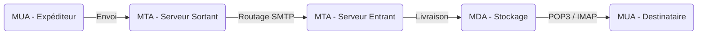

# Chapitre 3 - Les emails

### 1. Architecture globale d'un système de messagerie

L'envoi et la réception de courriels reposent sur trois composants principaux.

- **MUA (Mail User Agent)** : C'est le client de messagerie utilisé par l'utilisateur (ex: Thunderbird, Outlook, GMail).

- **MTA (Mail Transport Agent)** : C'est le serveur chargé de l'acheminement et du routage des courriels (ex: Postfix, Exim, Microsoft Exchange). Les MTA communiquent entre eux pour transférer le message d'un système à un autre.

- **MDA (Mail Delivery Agent)** : C'est le serveur qui réceptionne et stocke les courriels dans la boîte de l'utilisateur (ex: Procmail, Cyrus). Le MUA du destinataire vient ensuite récupérer ces messages via les protocoles **POP3** (téléchargement) ou **IMAP** (synchronisation).

---

### 2. Le protocole SMTP et l'extension MIME

Le protocole SMTP (Simple Message Transport Protocol) gère le transport des courriels sur le réseau TCP. Historiquement, il n'a pas été conçu pour être sécurisé.

- **Ports standards** :
- **25** : Sans authentification et en clair.

- **587** : Avec authentification, en clair par défaut mais souvent sécurisé via TLS (STARTTLS).

- **465** : Avec authentification et chiffré obligatoirement via TLS.

- **Déroulement d'un envoi** : L'enveloppe est rédigée avec les commandes `EHLO` (présentation), `MAIL FROM` (expéditeur) et `RCPT TO` (destinataire). Le corps du message est initié par `DATA` et la session se termine par `QUIT`.

- **MIME (Multipurpose Internet Mail Extensions)** : SMTP étant orienté texte, MIME permet d'étendre les capacités du courriel pour supporter le texte enrichi (HTML) et l'ajout de pièces jointes (images, binaires, vidéos). L'en-tête `Content-Type` définit le format des données, par exemple `multipart/alternative` pour combiner plusieurs formats.

---

### 3. Réputation et Sécurité : SPF, DKIM et DMARC

Pour lutter contre le spam et le hameçonnage (phishing), un serveur doit prouver son identité et garantir que les messages ne sont pas altérés. Ce trio de protocoles assure cette sécurité.

#### A. SPF (Sender Policy Framework)

- **Rôle** : Vérifier que le serveur qui envoie le courriel est formellement autorisé par le nom de domaine de l'expéditeur.

- **Fonctionnement** : Un enregistrement `TXT` est ajouté dans la zone DNS du domaine. Il liste les IP et mécanismes autorisés (ex: `ipv4`, `mx`, `include`).

- **Action finale** : Le qualificatif en fin de règle définit la politique, par exemple `-all` (rejette tout le reste), `~all` (accepte mais marque comme suspect), ou `+all` (autorise tout).

- **Limites** : SPF est limité à 10 requêtes DNS, il gère mal le transfert de courriels (forwarding), n'offre pas de rapports, et ne vérifie pas l'en-tête `From` visible par l'utilisateur.

#### B. DKIM (Domain Keys Identified Mail)

- **Rôle** : Garantir l'authenticité et l'intégrité du message. Il vérifie que le courriel n'a pas été modifié en cours de route.

- **Fonctionnement** : Le serveur d'envoi hache et signe numériquement certaines en-têtes et le corps du message avec une clé privée. Le serveur de réception récupère la clé publique correspondante via une requête DNS (grâce au "sélecteur" défini dans la signature DKIM, par ex: `s=2025`) et déchiffre la signature pour vérifier le contenu.

- **Limites** : DKIM seul n'est pas contraignant, ne fournit pas de rapports, et l'intégrité ne couvre qu'une partie ciblée du courriel.

#### C. DMARC (Domain-based Message Authentication, Reporting, and Conformance)

- **Rôle** : DMARC s'appuie sur SPF et DKIM pour apporter une politique stricte, un alignement des domaines et un système de reporting.

- **Authenticité (Alignement)** : DMARC vérifie que le domaine visible dans le champ `From` correspond bien au domaine validé par SPF (Return-Path) et par DKIM (`d=`).

- **Conformité (Politique `p=`)** : Indique aux serveurs de réception quoi faire en cas d'échec des tests. Les options sont `none` (ne rien faire), `quarantine` (placer en spam), ou `reject` (refuser le message).

- **Rapports (`rua` et `ruf`)** : Permet de recevoir des rapports réguliers (souvent en XML) sur les courriels traités et les éventuels échecs.

---

### 4. Mise en pratique avec Postfix

Postfix est un serveur de messagerie (MTA) très courant sous Linux.

- **Rôles possibles** : Il peut livrer le courrier localement, ou servir de relais (smarthost) vers un autre serveur.

- **Configuration de base** : Les paramètres se trouvent dans `/etc/postfix/main.cf`.

- `mydestination` : Liste les domaines gérés localement par la machine.

- `relayhost` : Définit le serveur vers lequel relayer les messages sortants (s'il est vide, Postfix envoie les courriels lui-même).

- **Intégration des filtres (Milters)** : Pour appliquer DKIM et DMARC, Postfix délègue le traitement à des services externes comme OpenDKIM et OpenDMARC via l'attribut `smtpd_milters`. OpenDKIM génère et vérifie les signatures, tandis qu'OpenDMARC applique la politique et gère les rapports.

 

<a href="../Chapitre-3/Examen.md">⬅️ Vers le readme</a>
<a href="../Chapitre-4/Examen.md">Chapitre suivant ➡️</a>

