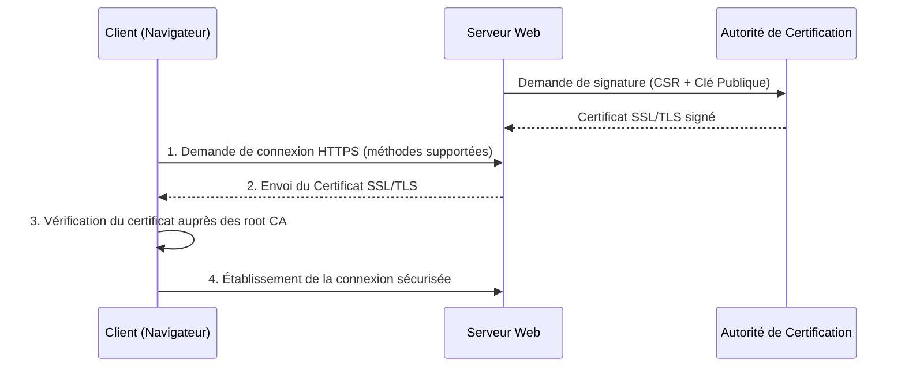
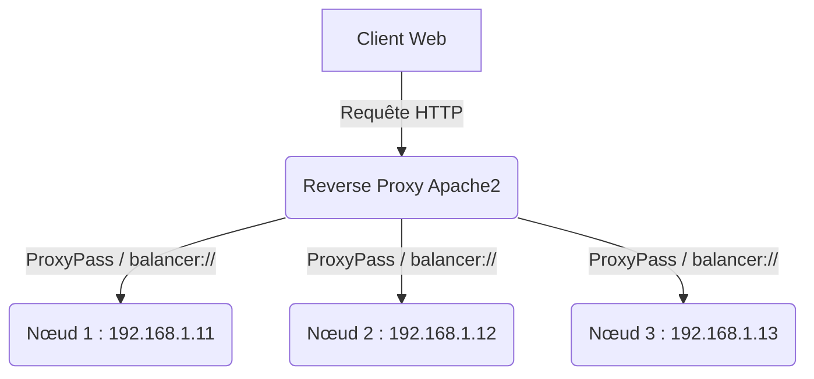

# Chapitre 4 : HTTP\[s\] - Hyper Text Transfert Protocol

### 1. Fondations : HTTP et requêtes

HTTP (Hyper Text Transfer Protocol) est le protocole fondamental du Web et non de l'Internet dans sa globalité. Il fonctionne sur le protocole TCP, classiquement sur le port 80.

Les interactions sont basées sur un système de requêtes et de réponses, facilement testables avec des outils terminaux comme `nc` ou `curl`.

- **Structure d'une requête** : Elle débute par la méthode, l'URI (la page demandée) et la version du protocole.

- **Méthodes principales** : `GET` (récupérer), `POST` (envoyer pour traitement), `PUT` (remplacer), `DELETE` (supprimer), `HEAD` (obtenir les en-têtes sans le contenu).

- **Entêtes (Headers)** : Des paires clé/valeur définissant le contexte. L'entête `host:` est obligatoire et précise le nom de domaine visé, ce qui est indispensable pour les serveurs gérant plusieurs sites. Les entêtes comme `user-agent` ou `accept-language` servent souvent au pistage par empreinte digitale (fingerprinting).

---

### 2. Réponses, Cache et Sessions

La réponse du serveur commence par un code de statut (status code) qui informe sur le résultat de la requête.

- **1xx** : Information.

- **2xx** : Succès (ex. 200 OK).

- **3xx** : Redirection (ex. 301 Permanente, 307 Temporaire).

- **4xx** : Erreur client (ex. 403 Forbidden, 404 Not found).

- **5xx** : Erreur serveur (ex. 500 Internal error, 502 Bad gateway).

Le protocole HTTP gère également l'optimisation et la persistance :

- **Cache** : L'entête `Cache-Control` (avec des attributs comme `max-age` ou `no-store`) indique au navigateur ou au proxy comment et combien de temps conserver les ressources localement pour éviter les requêtes répétées.

- **Cookies** : Données envoyées par le serveur et stockées par le navigateur pour gérer les sessions, la personnalisation ou le pistage. Ils tendent à être remplacés par les technologies de stockage local du navigateur (localstorage, IndexedDB).

---

### 3. La sécurité avec HTTPS

HTTPS encapsule les requêtes HTTP classiques dans un tunnel sécurisé par TLS, par défaut sur le port 443.

(Représentation des processus de sécurisation HTTPS )

Ce tunnel fournit trois garanties essentielles :

- **Confidentialité** : Le trafic est chiffré.

- **Intégrité** : Les données ne peuvent pas être modifiées en transit.

- **Authentification** : Preuve cryptographique de l'identité du serveur, validée par une autorité de certification (CA). Ces certificats ont une durée de vie limitée (actuellement 398 jours, bientôt 47 jours) et peuvent être gérés de façon automatisée via Let's Encrypt et Certbot.

---

### 4. Les Serveurs Web : Architectures et Outils

Les serveurs web (MTA) traitent les requêtes et renvoient l'information. Le document aborde trois logiciels majeurs.

#### A. Apache2

Un serveur robuste avec une architecture hautement modulaire.

- **Configuration** : Gérée via `/etc/apache2/`, avec des répertoires séparant les éléments disponibles (`available`) et activés (`enabled`) pour les sites et les modules.

- **Hôtes virtuels (vhosts)** : Permettent d'héberger plusieurs noms de domaine sur une seule machine via la directive `ServerName`.

- **Gestion des ressources (MPM)** : Les modules multi-processus gèrent les processus et les threads. Le module `event` est le standard sur les systèmes modernes pour optimiser la charge.

- **Contrôle d'accès** : Les directives `Require` (ACL) peuvent être placées dans la configuration générale ou dans des fichiers locaux `.htaccess` pour gérer les authentifications (Basic, certificats) ou bloquer des IPs.

Apache est fréquemment utilisé en tant que mandataire inverse (Reverse Proxy) ou répartiteur de charge (Load Balancer).

(Répartition de la charge avec le module `mod_proxy_balancer` )

#### B. Nginx

Souvent utilisé pour ses hautes performances, Nginx organise sa configuration autour de "server blocks".

- **Structure** : Les blocs `server { }` interceptent les requêtes en fonction du `server_name` et dirigent le trafic via des blocs `location / { }`.

- **Proxy** : La configuration d'un mandataire inverse y est très directe grâce à la directive `proxy_pass`.

- **Note d'actualité** : Un fork nommé `freenginx` a été créé récemment pour protéger la philosophie libre du projet.

#### C. Caddy Server

Un serveur très moderne privilégiant la simplicité et la sécurité par défaut.

- **Configuration centralisée** : Utilise principalement un fichier `CaddyFile` (ou du JSON).

- **HTTPS automatique** : C'est son grand point fort. Caddy provisionne et renouvelle automatiquement les certificats SSL/TLS publics (via Let's Encrypt par exemple) ou locaux selon le type d'adresse configurée.

 

<a href="../Chapitre-3/Examen.md">⬅️ Vers le chapitre précédent</a> |
<a href="../README.md">Vers le readme ➡️</a>

