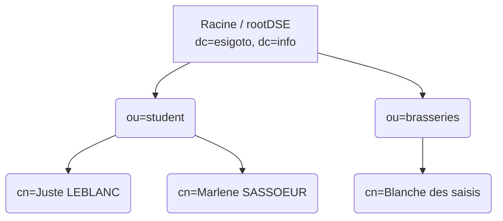

### 1. Concepts Fondamentaux : Qu'est-ce que LDAP ?

LDAP (Lightweight Directory Access Protocol) est un protocole d'accès à un annuaire. Contrairement à un SGBD relationnel classique, un annuaire LDAP est une base de données spécialisée avec une structure hiérarchique très forte, conçue pour un grand nombre de lectures et peu d'écritures.

Le modèle de données repose sur une arborescence (DIT - Directory Information Tree) où chaque nœud représente une entrée ou un objet.

- **DN (Distinguished Name)** : C'est l'identifiant unique absolu d'un nœud dans l'arbre (par exemple, `cn=Juste LEBLANC, ou=student, dc=esigoto, dc=info`).

- **Schémas et objectClass** : Chaque entrée appartient à une ou plusieurs classes d'objets (`objectClass`) qui définissent son type (structurel, abstrait ou auxiliaire). Les classes imposent des attributs obligatoires (`MUST`) et autorisent des attributs facultatifs (`MAY`).

- **Schema checking** : Lors de l'insertion d'une entrée, le serveur vérifie rigoureusement sa conformité syntaxique par rapport aux schémas activés.

---

### 2. Architecture et Configuration d'OpenLDAP (v2.4+)

OpenLDAP est une implémentation libre du protocole. Depuis la version 2.4, la configuration a radicalement changé.

- **Configuration dynamique (cn=config)** : Le fichier monolithique `slapd.conf` a disparu. La configuration se trouve désormais dans le répertoire `/etc/ldap/slapd.d` sous forme d'un annuaire LDAP interne.

- **Règle d'or** : Il ne faut jamais éditer les fichiers de `/etc/ldap/slapd.d` directement. Toute modification de configuration se fait "à chaud" via des opérations LDAP standard (`ldapadd`, `ldapmodify`) sur l'arbre `cn=config`.

- **Schémas** : Les fichiers de schémas (comme `inetorgperson.schema` ou `core.schema`) se trouvent dans `/etc/ldap/schema/`. Pour intégrer un schéma personnalisé, il faut obtenir un OID (Object Identifier) unique auprès de l'IANA.

---

### 3. Le format LDIF

Le LDIF (LDAP Data Interchange Format) est le format texte standard pour représenter, importer, exporter et modifier les données de l'annuaire.

- **Règles syntaxiques** : Les espaces sont cruciaux. Une ligne vide sépare deux entrées distinctes, et une ligne commençant par un espace indique la continuation de la ligne précédente. Les données doivent être encodées en UTF-8.

- **Opérations (`changetype`)** : Permet de définir l'action à réaliser (`add`, `delete`, `modify`, `modrdn`, `moddn`).

- **Modifications fines** : Avec `changetype: modify`, il est possible de cibler des attributs spécifiques en utilisant :
- `add` : Ajoute une valeur à un attribut.

- `replace` : Remplace toutes les valeurs existantes d'un attribut.

- `delete` : Supprime l'attribut ou une valeur spécifique de cet attribut.

---

### 4. Sécurité : ACL et Chiffrement

La sécurité d'un annuaire LDAP est critique, notamment parce que le protocole transmet par défaut les données et les mots de passe de connexion (bind) en clair sur le réseau.

#### A. Le chiffrement (TLS/LDAPS)

- **StartTLS (port 389)** : Permet de transformer une connexion standard en clair en une connexion sécurisée TLS de manière dynamique. S'initie avec l'option `-ZZ` dans les commandes clientes.

- **LDAPS (port 636)** : Force l'utilisation de TLS dès l'initiation de la connexion, de manière similaire à HTTPS. La configuration nécessite des certificats (`olcTLSCertificateFile`, `olcTLSCertificateKeyFile`) insérés via LDIF.

#### B. Les listes de contrôle d'accès (ACL)

Les ACL gèrent les permissions internes de l'annuaire via l'attribut `olcAccess`. Une directive définit :

- **Quoi** : L'entrée ou l'attribut ciblé.

- **Qui** : L'entité requérante (`*`, `anonymous`, `users`, `self`).

- **Niveau d'accès** : De `none` (aucun accès) à `manage` (gestion totale). Donner un accès supérieur (comme `write`) accorde implicitement les niveaux inférieurs (`read`, `search`, `compare`, `auth`).
  L'ordre d'évaluation des règles est strict et séquentiel.

---

### 5. Modèle Fonctionnel et Utilitaires

L'interaction avec le serveur repose sur des commandes clientes spécifiques qui mappent les opérations du protocole.

- **Recherche (`ldapsearch`)** : Permet d'interroger l'annuaire.

- La portée (`scope`) peut être `base` (le nœud exact), `onelevel` (les enfants directs), ou `subtree` (toute la branche).

- Les filtres utilisent la notation préfixée avec des opérateurs booléens (`&` pour ET, `|` pour OU, `!` pour NON). Exemple : `(&(ou=*Silly*)(cn=pils))`.

- **Modification (`ldapadd`, `ldapmodify`, `ldapdelete`)** : Ces commandes appliquent les fichiers LDIF.

- Exemple d'authentification simple : `ldapadd -D "cn=admin,dc=esigoto,dc=info" -W -f /tmp/racine.ldif`. L'option `-D` spécifie le compte administrateur et `-W` force la demande du mot de passe de manière interactive.

